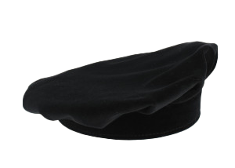

# FALUCHE

<!-- PROJECT LOGO -->
 

  

<h3 align="center">FALUCHE</h3>

  

    Simulation de FALUCHE et lexique des particularités

<!-- ABOUT THE PROJECT -->
## About The Project

Il s'agit d'un site internet qui permet de visualiser une faluche et ses différentes modifications selon le code d'une ville. 
Pour l'instant, le projet est concentré sur une simulation d'une faluche selon le code Toulousain. 
Des fonctionnalités pour simuler une faluche d'une autre ville seront ajoutés à l'avenir.

<!-- Feuille de route -->
## Feuille de route

- [ ] Faire le modèle 3D de la Faluche
- [ ] Faire la simulation a plat
- [ ] Commencer la carte

<!-- LICENSE -->
## License

<!-- CONTACT -->
## Contact

AtlosPrime - Atlos@outlook.fr

Lien du projet : [https://github.com/AtlosPrime/FALUCHE](https://github.com/AtlosPrime/FALUCHE)

<!-- ACKNOWLEDGMENTS -->
## Remerciements

* 
* 
* 

(<a href="#readme-top">back to top</a>)

